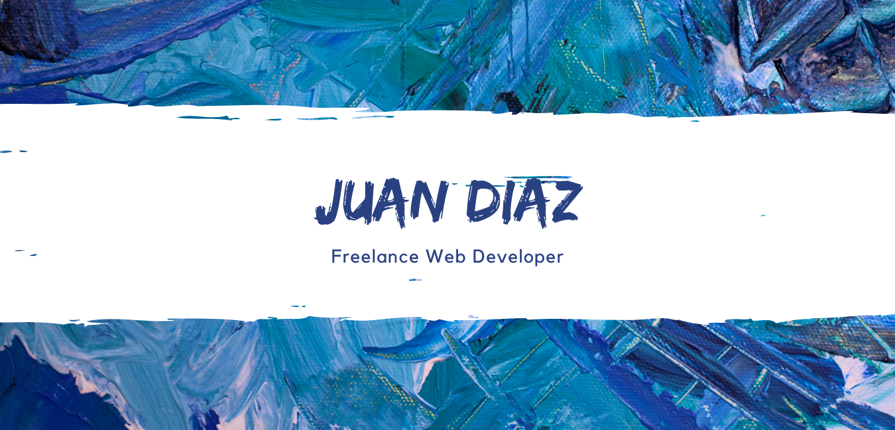
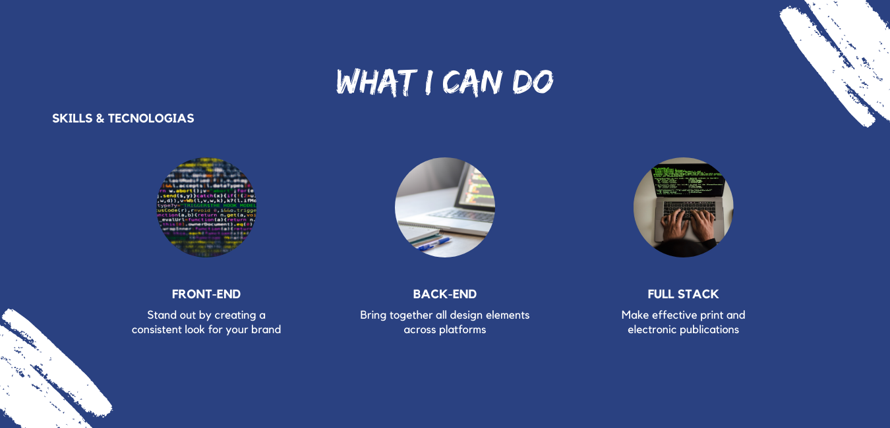
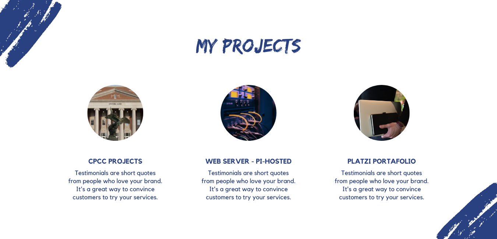
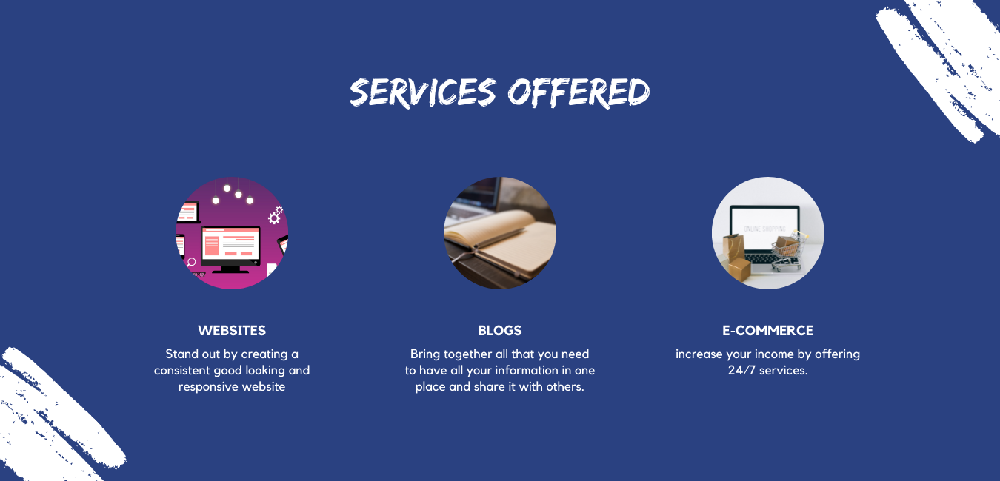
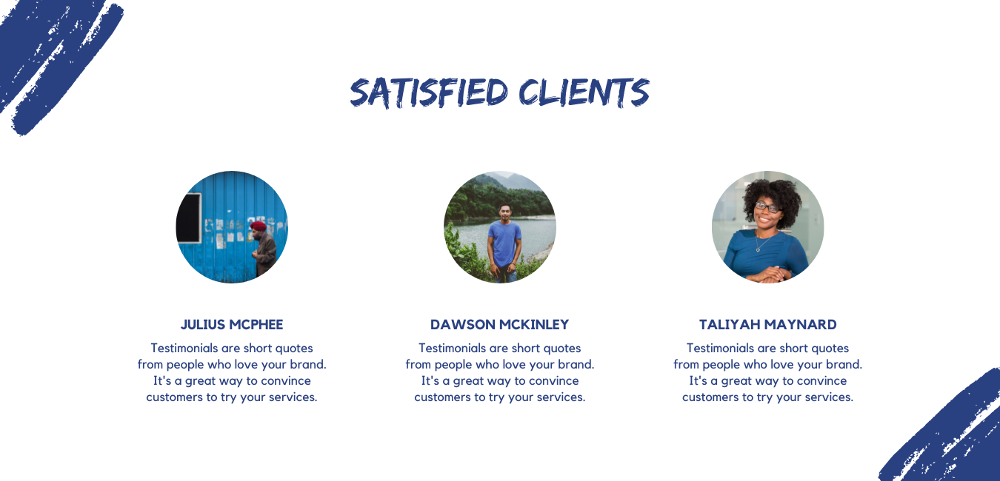

# ideal_portfolio_web

My Ideal Portfolio Website

## Description

A profesional website to promote my personal brand, describe who am I, what I can do, my latest projects, some of my services, satisfied clients and the best way to contact me.

## Getting Started

### Dependencies

- Basic knowlage of HTML, CSS, JS
- A domain & hostname.
- Great projects - proud to share.
- Pi-hosted project just be up an running.

## Project Images

### About me Section (My Profile)

### Lo que puedo hacer: incluir Skills & tecnologias

### My Projects

### Services

### Satisfied Clients

### Get in Touch (contact me)

## Authors

Contributors names and contact info

ex. [@juanDiaz](https://twitter.com/)

## Version History

- 0.2
  - Various bug fixes and optimizations
  - See [commit change]() or See [release history]()
- 0.1
  - Initial Release

## License

This project is licensed under the [NAME HERE] License - see the LICENSE.md file for details

## Acknowledgments
